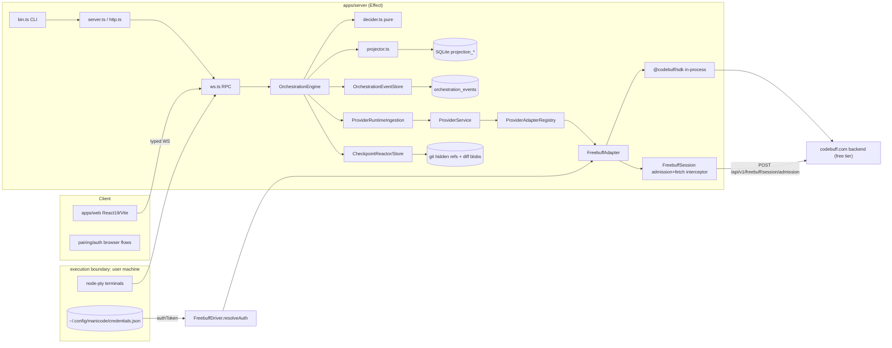

# KNOWLEDGE_GRAPH.md — OpenBuff

> Maintained by APEX-0. Updated after EVERY task. `file:line` claims are backed by direct reads.
> Confidence legend: **V** = verified by read/execution, **H** = heuristic/inferred, **U** = unverified.

## 0. Repo identity (observed)

| Field        | Value                                                                                                                                                         | Evidence                                                                                                             |
| ------------ | ------------------------------------------------------------------------------------------------------------------------------------------------------------- | -------------------------------------------------------------------------------------------------------------------- |
| Name         | `openbuff-monorepo`                                                                                                                                           | `package.json:2`                                                                                                     |
| What         | Open-source local web UI for the Freebuff agent; fork of pingdotgg/t3code (MIT)                                                                               | `README.md:1-17`                                                                                                     |
| Distribution | `npx openbuff@latest`; bin `openbuff` → `apps/server/dist/bin.mjs`                                                                                            | `README.md:13`, `apps/server/package.json:8-10`                                                                      |
| Engine       | `@codebuff/sdk` 0.10.x runs the agent loop in-process (no provider CLIs)                                                                                      | `apps/server/package.json:19`, `apps/server/src/provider/Drivers/FreebuffDriver.ts:1-10`                             |
| Stack        | pnpm 11.10 monorepo, Node >=24.13.1, Effect 4.0.0-beta.103, TypeScript ~6.0.3 (tsgo), vite-plus, React 19.2.6, Tailwind v4, SQLite (`@effect/sql-sqlite-bun`) | `package.json:46-52`, `pnpm-workspace.yaml:1-10,42-66`, `apps/web/package.json:31-56`, `apps/server/package.json:21` |
| Status       | Very early fork; last commits all Freebuff-driver fixes (M3 Expressive design just landed)                                                                    | `git log`: `15f3bc76`, `c0953ccf`                                                                                    |

## 1. Entities

### 1.1 Workspaces (pnpm)

`apps/server`, `apps/web`, `packages/contracts`, `packages/shared`, `packages/client-runtime`, `packages/ssh`, `packages/tailscale`, `oxlint-plugin-t3code`, `scripts`, `infra/*` — `pnpm-workspace.yaml:1-7`.

### 1.2 Services (server: `apps/server/src`)

| Entity                                 | Role                                                                                                                                                                 | Evidence                                                                                                                |
| -------------------------------------- | -------------------------------------------------------------------------------------------------------------------------------------------------------------------- | ----------------------------------------------------------------------------------------------------------------------- |
| `bin.ts` → CLI (`effect/unstable/cli`) | `openbuff` root cmd; subs: start/serve/pair/auth/project/service/servicePreflight/connect(hidden w/o config)                                                         | `bin.ts:10-18,45-60`                                                                                                    |
| `ws.ts`                                | WebSocket RPC surface; imports `ORCHESTRATION_WS_METHODS`, orchestration/git/project/relay errors (2361 lines)                                                       | `ws.ts:1-45`                                                                                                            |
| `server.ts`                            | HTTP+WS server assembly                                                                                                                                              | exists, not yet read (U)                                                                                                |
| `bootstrap.ts`                         | Launch handshake over stdio FDs (desktop service launcher path)                                                                                                      | `bootstrap.ts:1-60`                                                                                                     |
| Orchestration                          | `OrchestrationEngineService`: `readEvents`, `dispatch`, `streamDomainEvents`, `latestSequence`; pure `decider.ts` + `projector.ts`; per-aggregate command invariants | `orchestration/Services/OrchestrationEngine.ts:21-77`, `orchestration/decider.ts`, `orchestration/commandInvariants.ts` |
| Provider runtime                       | `ProviderService`, adapter SPI `ProviderAdapterShape`, session registries                                                                                            | `provider/Services/*`                                                                                                   |
| Persistence                            | SQLite event store + projection services; 40 sequential migrations                                                                                                   | `persistence/Services/*`, `persistence/Migrations.ts:22-67`                                                             |
| Checkpointing                          | `CheckpointStore`, `CheckpointDiffQuery`, `Diffs` (git-hidden-refs model per glossary)                                                                               | `checkpointing/*`, `docs/internals/glossary.md:120+`                                                                    |
| CLI auth                               | `cli/auth.ts` (login/credential reuse)                                                                                                                               | `bin.ts:15`                                                                                                             |

### 1.3 Provider layer (the fork's core)

| Entity                        | Role                                                                                                                                                                                                                                                                                                                                                                                                                           | Evidence                                                       |
| ----------------------------- | ------------------------------------------------------------------------------------------------------------------------------------------------------------------------------------------------------------------------------------------------------------------------------------------------------------------------------------------------------------------------------------------------------------------------------ | -------------------------------------------------------------- |
| `FreebuffDriver`              | Only driver under `provider/Drivers/`. `create` materializes adapter closure + snapshot; no subprocess. Auth resolution: settings override → `CODEBUFF_API_KEY` env → `~/.config/manicode/credentials.json` (`default.authToken`)                                                                                                                                                                                              | dir listing `provider/Drivers/`, `FreebuffDriver.ts:24,62-117` |
| `makeHeuristicTextGeneration` | Local stubs for commit-msg/PR/branch/thread-title (no model call)                                                                                                                                                                                                                                                                                                                                                              | `FreebuffDriver.ts:120-152`                                    |
| `FreebuffAdapter`             | Transliterates SDK callbacks → canonical `ProviderRuntimeEvent` (delta/tool_call/tool_result/completed/aborted/failed); stores `RunState` per thread for resume; `readThread` reconstructs from turns; `rollbackThread` = no-op v1; `pendingApprovals` map + `autoApproveCommands` for command approvals                                                                                                                       | `FreebuffAdapter.ts:1-22,86-115,117+`                          |
| `FreebuffSession`             | Free-tier admission: POST `https://www.codebuff.com/api/v1/freebuff/session/admission` (dedicated route) → `instanceId`; DELETE release still uses `/api/v1/freebuff/session`; `installFreebuffFetchInterceptor` wraps `globalThis.fetch` to inject `codebuff_metadata.freebuff_instance_id` via `AsyncLocalStorage`; free pin `deepseek/deepseek-v4-flash`; admission/poll surface `rateLimitsByModel` (per-model quota rows) | `FreebuffSession.ts:8-35,44,52,59-71`                          |
| Free-mode gates (3)           | (1) canonical system-prompt marker, (2) allowlisted agent+model, (3) active session instance id — else `waiting_room_required`                                                                                                                                                                                                                                                                                                 | `FreebuffSession.ts:8-19`                                      |

### 1.4 DB tables (SQLite, migrations 001–040)

Core: `orchestration_events` (m1), `orchestration_command_receipts` (m2), checkpoint diff blobs (m3), `provider_session_runtime` (m4) + mode/instance-id columns (m9, m27), projections (m5): `projection_projects`, `projection_threads` (+ runtime_mode m10, interaction_mode m12, archived_at m17/18, settled m33, snoozed m34, pinned m36/38), `projection_thread_messages` (+ attachments m7), `projection_thread_activities` (seq m8), `projection_turns` (+ source_proposed_plan m15, keyset index m37), `projection_thread_proposed_plans` (m13/14), `projection_pending_approvals` (m25 cleanup), `projection_checkpoints`, auth tables (m20/21/22/31/32), shell summary (m23/24/30), favicon (m40). Evidence: `persistence/Migrations.ts:22-67` + migration filenames.

### 1.5 External deps (runtime)

| Dep                                                       | Used by     | Why                               |
| --------------------------------------------------------- | ----------- | --------------------------------- |
| `@codebuff/sdk`                                           | server      | agent engine (in-process)         |
| `effect` + `@effect/platform-*`, `@effect/sql-sqlite-bun` | server      | runtime, DI, SQL                  |
| `node-pty`                                                | server      | terminals                         |
| `@pierre/diffs`                                           | server, web | diff rendering                    |
| `@clerk/react`                                            | web         | hosted auth (upstream remnant)    |
| TanStack Router, Zustand, Lexical, dnd-kit, Tailwind v4   | web         | UI                                |
| `vite-plus` (voidzero)                                    | all         | dev/build/test harness (`vp` CLI) |

### 1.6 Key functions

`resolveAuth` (`FreebuffDriver.ts:66`), `establishFreebuffSession` (`FreebuffSession.ts:87`), `installFreebuffFetchInterceptor` (`FreebuffSession.ts`, exported), `makeFreebuffAdapter` (`FreebuffAdapter.ts:70`), `mapToolNameToItemType` (`FreebuffAdapter.ts:117`), `OrchestrationEngine.dispatch` (`Services/OrchestrationEngine.ts:57`), `makeCli` (`bin.ts:42`).

## 2. Relations

| From                | Relation     | To                                                                                                                                     | Evidence                                                                         |
| ------------------- | ------------ | -------------------------------------------------------------------------------------------------------------------------------------- | -------------------------------------------------------------------------------- |
| web (browser)       | WS_CALLS     | `ws.ts` RPC methods                                                                                                                    | `ws.ts:17-45` (`ORCHESTRATION_WS_METHODS`)                                       |
| `bin.ts`            | OWNS         | CLI subcommands → `cli/server.ts` `runServerCommand`                                                                                   | `bin.ts:45-60`                                                                   |
| `runServerCommand`  | DEPENDS_ON   | server layers (http, ws, persistence, orchestration, provider)                                                                         | H (server.ts unread)                                                             |
| `ws.ts`             | CALLS        | `OrchestrationEngineService.dispatch` / read model                                                                                     | `OrchestrationEngine.ts:21-77` contract                                          |
| OrchestrationEngine | PERSISTS     | `OrchestrationEventStore` → SQLite                                                                                                     | `OrchestrationEngine.ts:8-11`, `persistence/Services/OrchestrationEventStore.ts` |
| events              | PROJECTED_BY | `projector.ts` → projection\_\* tables                                                                                                 | glossary + `persistence/Services/Projection*.ts`                                 |
| decider             | EMITS        | domain events (`thread.created`, …)                                                                                                    | glossary.md:64-77                                                                |
| ProviderService     | OWNS         | sessions; adapters via `ProviderAdapterRegistry`                                                                                       | `provider/Services/*`                                                            |
| `FreebuffAdapter`   | CALLS        | `@codebuff/sdk` `CodebuffClient.run` (1 run/turn)                                                                                      | `FreebuffAdapter.ts:3-6`                                                         |
| `FreebuffAdapter`   | USES         | `FreebuffSession.establish/interceptor` + per-model agent derivation (`resolveFreebuffAgentForModel`, contracts) + quota state capture | `FreebuffAdapter.ts:73-75,393,483`                                               |
| `FreebuffDriver`    | BUILDS       | `makeFreebuffAdapter` + `buildServerProvider` snapshot                                                                                 | `FreebuffDriver.ts:30-33`                                                        |
| `FreebuffSession`   | HTTP_POST    | codebuff.com `/api/v1/freebuff/session/admission` (release DELETE: `/api/v1/freebuff/session`)                                         | `FreebuffSession.ts:31-35,87`                                                    |
| SDK chat calls      | CARRY        | `codebuff_metadata.freebuff_instance_id`                                                                                               | `FreebuffSession.ts:24-29`                                                       |
| CheckpointReactor   | WRITES       | git hidden refs + `checkpoint diff blobs`                                                                                              | glossary.md:120+, m3                                                             |
| web                 | DEPENDS_ON   | `@t3tools/contracts`, `client-runtime`                                                                                                 | `apps/web/package.json:38-41`                                                    |

## 3. Graph

## 4. Known stale/conflicting docs (verified conflicts)

| Source says                                                                                                                           | Code shows                                                                                                                 | Verdict                                                         |
| ------------------------------------------------------------------------------------------------------------------------------------- | -------------------------------------------------------------------------------------------------------------------------- | --------------------------------------------------------------- |
| `AGENTS.md:5` "Node WebSocket server wraps provider CLIs (Codex, Claude, Cursor, Grok, OpenCode)"                                     | Only `FreebuffDriver.ts` exists in `provider/Drivers/`; SDK in-process                                                     | Docs stale (upstream)                                           |
| glossary.md "Five drivers ship built in"                                                                                              | one driver                                                                                                                 | Docs stale                                                      |
| `FreebuffAdapter.ts:16-19` "approvals … cannot yet reach a running SDK turn … arrive with the overrideTools interception in issue #4" | interface already has `pendingApprovals`, `autoApproveCommands` (#18 "terminal command approval flow" shipped per git log) | Header partially stale — verify behavior before trusting either |

## 5.5 Upstream reference: `.repos/freebuff` (CodebuffAI/freebuff, cloned 2026-09-16, read-only)

The vendor's own monorepo — `common/` (wire contracts), `cli/` (reference client), `sdk/` (engine we embed, same `0.10.7` as installed). Treat as protocol truth over our assumptions.

| Topic                 | Upstream truth                                                                                                                                                                                                                                                                                                 | Evidence                                                                              | Our fork                                                                                                                                                                                                                                                                          | Delta verdict                                                                                                                                                                           |
| --------------------- | -------------------------------------------------------------------------------------------------------------------------------------------------------------------------------------------------------------------------------------------------------------------------------------------------------------- | ------------------------------------------------------------------------------------- | --------------------------------------------------------------------------------------------------------------------------------------------------------------------------------------------------------------------------------------------------------------------------------- | --------------------------------------------------------------------------------------------------------------------------------------------------------------------------------------- |
| Admission POST path   | `/api/v1/freebuff/session/admission` (dedicated route; "fail closed on servers predating these guarantees")                                                                                                                                                                                                    | `common/src/constants/freebuff-models.ts:2510-2512`                                   | POSTs `/api/v1/freebuff/session` (the GET path)                                                                                                                                                                                                                                   | DIVERGENT — legacy path; fragile (works today per commit log, H)                                                                                                                        |
| POST headers          | `Authorization` + tz headers + `x-freebuff-first-tab-discount` + `x-freebuff-model` + `x-freebuff-wallet-spend-limit`; **no instance header on POST**                                                                                                                                                          | `cli/src/utils/freebuff-session-api.ts:80-105`                                        | sends `x-freebuff-instance-id` hint + `{}` body; omits wallet-limit + first-tab headers                                                                                                                                                                                           | DIVERGENT (hint header is GET/DELETE-only upstream)                                                                                                                                     |
| Instance id injection | SDK `RunParams.extraCodebuffMetadata` merges caller keys into `codebuff_metadata` (caller keys first, reserved ids protected)                                                                                                                                                                                  | `sdk/src/run.ts:240-243`, `sdk/src/impl/llm.ts:109-127`                               | `globalThis.fetch` interceptor + AsyncLocalStorage                                                                                                                                                                                                                                | Interceptor is a workaround: hook **absent from installed 0.10.7 dist** (0 occurrences verified); present in repo HEAD, unreleased (npm latest = 0.10.7). Delete interceptor on 0.10.8. |
| Gate codes            | `FREEBUFF_GATE_CODES`: rejection = (`error` code, HTTP status) **pair**; `waiting_room_required` 428, `session_expired` 410, `session_superseded` 409, `session_model_mismatch` 409 (all `endsTheSession`); `session_limit_reached` 409, `waiting_room_queued` 429, `model_unavailable` 410 (session survives) | `common/src/types/freebuff-session.ts` (`FREEBUFF_GATE_CODES`, `getFreebuffGateCode`) | **MATCH** — `provider/Services/FreebuffGate.ts` ports the table + pair-match; adapter failure handler classifies, marks seat `ended`/`superseded`, and re-admits on the next user turn (recovery policy per `cli/send-message.ts`; no background re-admit loops — upstream #1801) |
| Session lifecycle     | CLI polls GET `/session` (`x-freebuff-compact-session` beats); `ended`+`instanceId` = grace window, chat still flows; statuses: `model_locked`, `rate_limited`, `ip_capped`, `spend_limited`, `country_blocked`, `banned`, `model_unavailable`(`availableAt`/`withdrawn`)                                      | `freebuff-session-api.ts:140-205`, `freebuff-session.ts`                              | no poll loop at all; non-OK → generic throw                                                                                                                                                                                                                                       | GAP — no expiry awareness, raw errors reach users                                                                                                                                       |
| Model/agent pin       | `deepseek/deepseek-v4-flash` → agent `base3-free-deepseek-flash` is a real allowlisted pairing                                                                                                                                                                                                                 | `common/src/constants/free-agents.ts:126`                                             | same pin                                                                                                                                                                                                                                                                          | MATCH ✓                                                                                                                                                                                 |
| Prompt gate           | `hasFreebuffRootSystemPromptOpening`: canonical marker prefix accepted, pre-2026-07-07 base2 opening accepted, Freebuff2API "System Override" injection explicitly rejected                                                                                                                                    | `common/src/__tests__/free-agents.test.ts:315-334,615-640`                            | opens agent def with canonical marker                                                                                                                                                                                                                                             | MATCH ✓ (they also actively fight `Freebuff2API`-style proxies — noted)                                                                                                                 |
| API base              | `env.NEXT_PUBLIC_CODEBUFF_APP_URL \|\| 'https://codebuff.com'`                                                                                                                                                                                                                                                 | `freebuff-session-api.ts:78-80`                                                       | `https://www.codebuff.com`                                                                                                                                                                                                                                                        | Minor (www vs apex)                                                                                                                                                                     |

Model opportunities seen in `free-agents.ts:125-132`: `deepseek`, `mimo`, `minimax-m3`, `luna` (gpt-5.6), `glm`, `glm-5.3-flash`, `kimi-k3-eco` — a real model picker is possible against `SUPPORTED_FREEBUFF_MODELS`.

## 5. Runtime evidence (2026-09-16 boot)

- `pnpm install` green (2m14s); node-pty native build OK; effect-tsgo patch verified (`scripts/clean-tsgo-backups.mjs` + patch in root `prepare`).
- **Bug fixed:** `scripts/dev-runner.ts:79,83` filtered `--filter=t3` — package renamed to `openbuff` in commit `5a64e69f` but runner missed. `pnpm dev` would start contracts+web and never the server. Pinned test updated: `scripts/dev-runner.test.ts:95`. Confidence 100% (no `"name": "t3"` anywhere).
- Boot chain observed: migrations 1–40 applied → `Listening on http://127.0.0.1:13773` → reaper started → pairing URL minted (`/pair#token=...`).
- Web dev bind (post-#29): unconfigured binds `::` (dual-stack, v4-mapped) via `apps/web/src/devBindHost.ts` (probe-`::`-else-`0.0.0.0`; explicit `HOST` wins verbatim — desktop `127.0.0.1`). Cause of the earlier `[::1]:5733`-only binding: Node resolves a _hostname_ (`localhost`) to its first address only, OS-order dependent.
- Transient sandbox artifact (2026-09-16, once): a single curl to a v6 literal hung post-connect while node/python/ESTAB-pairs proved the socket healthy; never reproduced, three clients green.
- Pair page consumed token; preview landed on `/draft/<uuid>` with project `custom-learned-skills-dir`.
- Benign log noise: `TelemetryIdentityDecodeError` from stale `~/.codex/auth.json` (upstream telemetry identity path survives in server).
- UI flag: composer showed `gpt-5.6-sol` — upstream default at `packages/contracts/src/model.ts:136` (`DEFAULT_MODEL`), map still Codex-keyed at :150-151. Cosmetic for free-tier (server strips paid overrides, commit `9f6da131`) but a UI lie; fix candidate.

## 6. Task log (append every task)

| Date       | Task                                                                                                                                                                                                                                                                                                                                                                                                                                                                                                                                                                                                                                                                                                                                                                                                                                                                                                                                                                                                      | Graph nodes touched                                                                                                                                                                   |
| ---------- | --------------------------------------------------------------------------------------------------------------------------------------------------------------------------------------------------------------------------------------------------------------------------------------------------------------------------------------------------------------------------------------------------------------------------------------------------------------------------------------------------------------------------------------------------------------------------------------------------------------------------------------------------------------------------------------------------------------------------------------------------------------------------------------------------------------------------------------------------------------------------------------------------------------------------------------------------------------------------------------------------------- | ------------------------------------------------------------------------------------------------------------------------------------------------------------------------------------- |
| 2026-09-16 | Phase 0 bootstrap: repo map + graph v0                                                                                                                                                                                                                                                                                                                                                                                                                                                                                                                                                                                                                                                                                                                                                                                                                                                                                                                                                                    | all (initial)                                                                                                                                                                         |
| 2026-09-16 | Boot: fix dev-runner filters (`t3`→`openbuff`), install, launch, verify web+api, pair, preview                                                                                                                                                                                                                                                                                                                                                                                                                                                                                                                                                                                                                                                                                                                                                                                                                                                                                                            | scripts/dev-runner, bin/cli, migrations, runtime ports, contracts/model.ts                                                                                                            |
| 2026-09-16 | Upstream dive: cloned CodebuffAI/freebuff to `.repos/freebuff`; protocol audit vs our FreebuffSession/Adapter (§5.5)                                                                                                                                                                                                                                                                                                                                                                                                                                                                                                                                                                                                                                                                                                                                                                                                                                                                                      | common/freebuff-models.ts, freebuff-session.ts, cli/freebuff-session-api.ts, sdk/run.ts+impl/llm.ts, free-agents.ts                                                                   |
| 2026-09-16 | Factory bootstrap + vendor-subject ban merged (PRs #35, #38); first work PR: dev-runner filter rename (#39)                                                                                                                                                                                                                                                                                                                                                                                                                                                                                                                                                                                                                                                                                                                                                                                                                                                                                               | AGENTS.md, agents/_, .github/workflows/_, scripts/dev-runner                                                                                                                          |
| 2026-09-16 | Test debt cleared (PR #41): auth-bootstrap + provider-settings + dead-import fixes; main fully green; vendored reference snapshot committed                                                                                                                                                                                                                                                                                                                                                                                                                                                                                                                                                                                                                                                                                                                                                                                                                                                               | apps/web tests, apps/server/test/ActivityPayloadProjection, .repos/freebuff                                                                                                           |
| 2026-09-16 | Gate classifier implemented (#23): pair-match port + adapter wiring + recovery dispositions (issue amended from evidence: no auto re-admit)                                                                                                                                                                                                                                                                                                                                                                                                                                                                                                                                                                                                                                                                                                                                                                                                                                                               | provider/Services/FreebuffGate.ts, FreebuffAdapter.ts, §5.5 gate row flipped                                                                                                          |
| 2026-09-16 | Admission route port (#24): POST `/api/v1/freebuff/session/admission`, upstream header set (timezone, first-tab, spend-limit), typed gate bodies (403/409/429), 404/405 unsupported-server error                                                                                                                                                                                                                                                                                                                                                                                                                                                                                                                                                                                                                                                                                                                                                                                                          | provider/Services/FreebuffSession.ts (establishFreebuffSession, FreebuffSessionRequestError), FreebuffSession.test.ts                                                                 |
| 2026-09-16 | Docs correction + process hardening: graph POST refs fixed (PR #44, CodeRabbit finding); evolution lessons: PIPESTATUS, exactOptionalPropertyTypes, globalDate opt-out, no merge-in-review-batch                                                                                                                                                                                                                                                                                                                                                                                                                                                                                                                                                                                                                                                                                                                                                                                                          | EVOLUTION_LOG.md, docs/KNOWLEDGE_GRAPH.md                                                                                                                                             |
| 2026-09-16 | Dev bind dual-stack (#29, PR #49): `::` default + runtime v6 probe fallback, explicit `HOST` verbatim; live dual-stack curl/node proof + desktop-mode contract                                                                                                                                                                                                                                                                                                                                                                                                                                                                                                                                                                                                                                                                                                                                                                                                                                            | apps/web/vite.config.ts, apps/web/src/devBindHost.ts (+test)                                                                                                                          |
| 2026-09-16 | Session poll (#25): GET poll w/ instance+compact headers, 404→none, pure classifier (active/grace/gone/superseded/blocked/unknown), turn-boundary wiring (gone→inline re-admit, grace→block new prompts, poll failure never kills session); background fiber + UI badge deferred to #31                                                                                                                                                                                                                                                                                                                                                                                                                                                                                                                                                                                                                                                                                                                   | provider/Services/FreebuffSession.ts (pollFreebuffSession, classifySessionPoll), FreebuffAdapter.ts, FreebuffSessionPoll.test.ts                                                      |
| 2026-09-16 | Free default model (#28): DEFAULT_FREEBUFF_FREE_MODEL + freebuff map entry in contracts; auto-bootstrap selection is settings-aware (first enabled driver, per-driver chat default, codex fallback); boot path reads live ServerSettings                                                                                                                                                                                                                                                                                                                                                                                                                                                                                                                                                                                                                                                                                                                                                                  | packages/contracts/src/model.ts (+test), apps/server/src/serverRuntimeStartup.ts (+test, layerTest harness)                                                                           |
| 2026-09-16 | Free tier model map (#27, PR 1 of 2): contracts 8-pairing `FREEBUFF_FREE_AGENT_BY_MODEL` + `resolveFreebuffAgentForModel` (unknown→flash root); adapter derives agent from request model (hardcoded pin removed); `rateLimitsByModel` captured from admission/poll onto session state                                                                                                                                                                                                                                                                                                                                                                                                                                                                                                                                                                                                                                                                                                                     | packages/contracts/src/model.ts (+test), apps/server/src/provider/Services/FreebuffAdapter.ts, FreebuffSession.ts (+FreebuffSessionQuota.test.ts)                                     |
| 2026-09-16 | Free tier picker rows (#27, PR 2a): driver snapshot serves the 8 allowlisted models (contracts map + upstream display names, flash pinned default) — composer picker now renders all free-tier rows; selection flows through PR 1 per-model agent derivation                                                                                                                                                                                                                                                                                                                                                                                                                                                                                                                                                                                                                                                                                                                                              | apps/server/src/provider/Drivers/FreebuffDriver.ts (+FreebuffDriver.snapshot.test.ts)                                                                                                 |
| 2026-09-16 | Usage capture + transport (#31, PR 3a): session responses surface freeWindows/freebucks (null-preserving); contracts FreebuffProviderUsage on ServerProvider; adapter captures via usageRef, driver snapshot merges freshest-wins (mergeProviderUsage + usageFromSessionResponse)                                                                                                                                                                                                                                                                                                                                                                                                                                                                                                                                                                                                                                                                                                                         | packages/contracts/src/server.ts (+test), apps/server/src/provider/providerUsageMerge.ts (+test), Services/FreebuffSession.ts, Services/FreebuffAdapter.ts, Drivers/FreebuffDriver.ts |
| 2026-09-16 | Quota cockpit panel (#31, PR 3b): settings panel renders per-pool bars (opaque-pool grouping, server labels), freeWindows, Freebucks daily+wallet with quotaExempt badge; null-freebucks clears stale balances; minute-granularity tick (no repaint loops)                                                                                                                                                                                                                                                                                                                                                                                                                                                                                                                                                                                                                                                                                                                                                | apps/web/src/components/settings/FreebuffCockpit.tsx (+test), freebuffCockpit.logic.ts (+test), SettingsPanels.tsx                                                                    |
| 2026-09-16 | Gate prose flows (#27, PR 2b): model_unavailable renders upstream's availableHours prose floor + reader-local availableAt (Intl, never recomputed pools; no invented times on older servers); model_locked surfaces current→requested switch prose in the turn failure; gate fields typed on FreebuffSessionResponse                                                                                                                                                                                                                                                                                                                                                                                                                                                                                                                                                                                                                                                                                      | apps/server/src/provider/Services/FreebuffSession.ts (+FreebuffSessionGate.test.ts), Services/FreebuffAdapter.ts                                                                      |
| 2026-09-16 | Telemetry decode noise silenced (#30): TelemetryIdentityDecodeError demoted Warn→Debug (stale auth.json is expected on a best-effort probe); read failures keep warning; issue premise corrected — codex identity probe retained because the codex driver is live here, removal would break identity stability                                                                                                                                                                                                                                                                                                                                                                                                                                                                                                                                                                                                                                                                                            | apps/server/src/telemetry/Identify.ts (+Identify.test.ts level assertions)                                                                                                            |
| 2026-09-16 | Session close (#57): evolution log carries lock-in lessons (fixture-overwrite=invariant deletion, research-sourced test literals, gates-after-final-edit); merge-before-green counter hit 3 on a docs PR, verified post-merge all-SUCCESS                                                                                                                                                                                                                                                                                                                                                                                                                                                                                                                                                                                                                                                                                                                                                                 | EVOLUTION_LOG.md                                                                                                                                                                      |
| 2026-09-17 | Stop→release (#55, server half): stopSession/stopAll DELETE the upstream seat when owned (never on `superseded` — would evict the other client's session; never when unadmitted); release is best-effort (ignoreCause, sweep backstop); adapter gains `fetchImpl`/`clientFactory` test seams; `releaseFreebuffSession` gets `opts.fetch` override; Effect 4 gotchas banked: andThen needs an effect (not a callback returning undefined), ignoreCause for promise-defect tolerance                                                                                                                                                                                                                                                                                                                                                                                                                                                                                                                        | apps/server/src/provider/Services/FreebuffSession.ts (+release.test), Services/FreebuffAdapter.ts (+release.test)                                                                     |
| 2026-09-17 | Stop→release round 2 (#60): CodeRabbit Majors fixed — stopSession deletes only the captured state (replacement race), release DELETE bounded 5s via AbortSignal.timeout + signal-abort race (never-settles fetch covered); cockpit test time bomb caught by CI gate (hardcoded resetAt expired) → fixtures now clock-relative; gate rule blocked merge twice this session                                                                                                                                                                                                                                                                                                                                                                                                                                                                                                                                                                                                                                 | apps/server/src/provider/Services/FreebuffSession.ts (+release.test), Services/FreebuffAdapter.ts, apps/web/src/components/settings/FreebuffCockpit.test.tsx                          |
| 2026-09-17 | Seat handoff UX (#55, web half): picker model switch on a live freebuff session confirms via themed dialog naming both models (display names from provider rows, slug fallback); confirm = apply + stop (server releases seat since #60, next turn re-admits); cancel untouched; pure decision helper keeps wire logic out of React; no-op switch cancelled without burning an admission                                                                                                                                                                                                                                                                                                                                                                                                                                                                                                                                                                                                                  | apps/web/src/components/chat/modelSwitchConfirmation.logic.ts (+test), ChatView.tsx                                                                                                   |
| 2026-09-18 | Docs sweep (#32): fork-reality rewrites — workspace-layout loses desktop/mobile/marketing/infra/effect-acp/effect-codex-app-server entries (verified absent on disk); remote.md keeps pairing/tailscale/relay-link reality, drops desktop-SSH fiction (packages/ssh kept, marked unwired); resource-telemetry Electron side marked upstream-only (server side verified real); user docs: install/remote-access/updating/permission-modes/thread-sidebar rewritten to openbuff CLI + Freebuff-only provider (bin `openbuff` verified in package.json, state dir `~/.openbuff` verified os-jank.ts:110); 7 upstream-only docs deleted (t3-connect, relay-observability, mobile-app-store-screenshots, release checklist, mobile-appearance, providers-codex/claude); observability paths re-anchored to deriveServerPaths truth; usage.md KEPT after verifying UsageService scans codex/claude transcripts (ccusage approach, usageTranscriptReader);dead links fixed (providers-codex/claude, release.md); CodeRabbit round (11 findings, all verified valid): Major fixed in code — `service.ts` + `BunPtyAdapter.ts` user-facing strings now say `npx openbuff@…`/`openbuff@…` (tests updated), remaining strings for follow-up issue (`invocation.ts` bunx cache-path detection); docs fixed: ci.md `vp run typecheck`, glossary duplicate `[20]` link label, overview fence language, remote relay summary, obs server.log contract + explicit-baseDir `/userdata/` truth (config.ts:109), install.md documents external `freebuff login` (driver reuses CLI/Desktop session, no browser flow) | 20 docs across docs/{user,internals,operations}, apps/web ghostty README, docs/README.md, apps/server cli+terminal strings |
| 2026-09-18 | Landing page (#33): design comp posted on the issue as the pre-implementation gate; Architect call = public `/welcome` route (lazy chunk) instead of hacking `_chat.index` — evidence: `_chat.beforeLoad` redirects unauth `/` to `/pair`, so the index component is unreachable when logged out; `_chat` now sends only the `/` pathname to `/welcome` (pair keeps everything else); welcome bounces authed/hosted-static visitors home. Component: Bodoni hero via lazy split module, copy chip on `useCopyToClipboard`, 3 verified facts, unslop-tested; zero new fonts/images. RenderToStaticMarkup gotcha banked: JSX text escapes `>=` → `&gt;=`, assert entity form | apps/web/src/routes/welcome.tsx (+_chat.tsx branch), components/landing/OpenBuffLanding.tsx (+test), BodoniHeadline.tsx |
| 2026-09-18 | Pinned-runtime package fix (#64): issue premise corrected — `detectCliRunner` keys on runner cache layouts, never package names; the REAL bug was `pinnedRuntime.ts` installing upstream `t3@<version>` from npm (service-update would pull pingdotgg's package). Now pins `openbuff@<version>` with entry under `node_modules/openbuff/`; contract test asserts the final npm arg starts `openbuff@`; package-agnostic runner detection locked by test; unit name `t3code.service`/`BOOT_SERVICE_NAME` left as-is (migration of existing installs needs its own issue) | apps/server/src/cloud/pinnedRuntime.ts (+test), selfUpdate.ts, bootService.ts, cli/invocation.ts (+test) |
| 2026-09-18 | Boot-unit rename + migration (#67): `BOOT_SERVICE_NAME` → `openbuff` (`openbuff.service`); `BOOT_SERVICE_UNIT_ENV` string kept (`T3_BOOT_SERVICE_UNIT` is write-only — the unit file embeds its value, nothing parses it, so the env name carries no legacy meaning); install() migrates a legacy `t3code.service` (best-effort disable --now, remove, daemon-reload) BEFORE the new unit starts — kills the split-brain-on-boot failure; uninstall() cleans both eras. `serviceStateHasPendingUpdate` reads the launcher-owned state file keyed by `T3CODE_HOME`, not the unit name — nothing to carry. RED harness exposes `home`; migration asserted via real unit files + exact systemctl command strings | apps/server/src/cloud/bootService.ts (+test) |
| 2026-09-18 | Legacy-unit status surfacing (#71): `BootServiceStatus.legacyInstalled` (read-only `fs.exists(legacyUnitPath)`, every platform, status() NEVER migrates — single-writer stays in install()); `formatServiceStatus` prints a t3-era migration line when only the legacy unit exists and a residue note when both do; service.test fixture de-t3'd (unitPath now openbuff.service). RED: 3 status + 2 formatter tests, all failing on missing field/line | apps/server/src/cloud/bootService.ts (+test), cli/service.ts (+test), docs/user/background-service.md |
| 2026-09-18 | Welcome head metadata (#72): `welcomeHead()` exported pure-data meta (title/description + og:title/og:description/og:type via `property`, verified in router-core route.d.ts:116), wired as `head: welcomeHead`; copy mirrors README verbatim; og:image deliberately ABSENT (no asset exists — a 404 preview is worse than none; follow-up when a real one ships). Tests assert the head-data contract (renderToStaticMarkup can't see TanStack's head layer) incl. unslop scan | apps/web/src/routes/welcome.tsx, components/landing/OpenBuffLanding.test.tsx |
| 2026-09-19 | og:image shipped (#75): real 1200x630 asset at apps/web/public/og.png — satori+resvg render from the app's OWN fonts (Bodoni Moda wght=700 opsz=96, Inter Tight) and real `--m3-*` token colors (oklch→sRGB via culori); `scripts/generate-og-image.mjs` is committed provenance (toolchain NOT a repo dep; createRequire resolves it locally; variable-font instancing via fonttools wawoff2). Asset verified pixel-audited + visually before commit; generation deterministic (byte-identical reruns); head/test flipped from forbidding og:image to requiring root-relative `/og.png` (no fixed prod origin exists — absolute URL would be a lie) | apps/web/public/og.png, scripts/generate-og-image.mjs, apps/web/src/routes/welcome.tsx, components/landing/OpenBuffLanding.test.tsx |
| 2026-09-19 | HeadContent mount (#77, CodeRabbit Minor on #75): route `head` config ≠ rendered head — `RootRouteView` never mounted `<HeadContent/>`, so ALL route meta (incl. og tags) was silent no-op; fixed by mounting in all 3 render branches (pair/connect, unauth gate, app shell), verified against installed @tanstack/react-router@1.170.10 source (`HeadContent` renders `useTags()` as real `<meta>`). ARCHITECTURE FACT: logged-out landing unreachable from the physical machine by design — `attemptLocalBootstrap` (environments/primary/auth.ts:322) auto-grants sessions to loopback same-origin browsers ("physical machine = identity"), HttpOnly cookies persist across ports; /welcome serves REMOTE visitors only. Sandbox ops: `setsid bash -c` survives tool boundary; vite-plus binds v6-side only (`*:port`, 127.0.0.1 refuses — #58 devBindHost validated); hermetic run = throwaway T3CODE_HOME server + T3CODE_PORT web proxy | apps/web/src/routes/__root.tsx, docs/KNOWLEDGE_GRAPH.md, EVOLUTION_LOG.md |
| 2026-09-19 | /pair head metadata (#79): the remote visitor's ACTUAL landing page (pairing links) had zero head config — now ships title/description/og:title/og:description/og:type/og:image, same idiom as welcomeHead, copy mirrors the one-time-token exchange (no invented claims). og:image INCLUDED on purpose (recorded in pair.tsx docblock): bare IP:port link without a preview card reads as phishing; token itself lives in the URL fragment which previewers never fetch | apps/web/src/routes/pair.tsx, apps/web/src/routes/pair.test.ts |
| 2026-09-19 | Pairing a11y (#80): pairing error/status states were plain divs — silent to screen readers. New primitives in PairingAlert.tsx: `PairingAlert` (role=alert, assertive) + `PairingStatus` (role=status, polite) + `busyAttribute` (aria-busy); wired into BOTH surfaces (manual token + hosted). Focus: token input autoFocus on mount, focus returns to input on failed submit (React 19 ref-as-prop verified through Input's nativeInput spread). House test idiom: renderToStaticMarkup on pure components (no DOM env in toolchain) | apps/web/src/components/auth/PairingAlert.tsx, apps/web/src/components/auth/PairingRouteSurface.tsx |
| 2026-09-19 | Fetch deadline (#84): exchangeBootstrapCredential had bounded RETRY (retryTransientBootstrap, 15s/500ms, 502/503/504+TypeError) but no DEADLINE — a never-settling fetch hung the pairing form forever; verified gap against installed client-runtime (remoteHttpClientLayer = plain FetchHttpClient, its timeoutOption machinery unwired for primary client). Fix: `Effect.timeoutOption` → typed `PrimaryEnvironmentRequestDeadlineError` (30s), rethrown before the generic fromCause wrap (fromCause maps transport errors to HTTP 500 → non-transient, so no retry spin). Proof: `Effect.never` handler + 50ms test deadline = deadline genuinely interrupts a hung exchange (real integration, not mock assertion). Effect-4 specifics: wrapper generic over <A,E,R> (context channel), concrete type is HttpClientError.HttpClientError (namespace ≠ type) | apps/web/src/environments/primary/auth.ts, apps/web/src/authBootstrap.test.ts |
| 2026-09-19 | Hosted-pairing security audit: resolveRemotePairingTarget (@t3tools/shared/remote.ts:188) accepts http/https/ws/wss, schemeless→https (self-hosted tradeoff, documented not broken); both network calls bounded (descriptor 10s via executeEnvironmentHttpRequest, bootstrap via client-runtime auth timeout) — NO hang/injection gap, no issue raised (no theater). Visual audit lesson: dist/ was STALE (built 03:24 vs #70's 07:34) → fresh-build grep is the only truth (`vp build` then grep the hashed CSS); SSR renderToStaticMarkup renders Suspense FALLBACK, not lazy components — static HTML ≠ runtime DOM for lazy trees. /connect (Clerk auto-redirect) deliberately skipped for head work. Settings-route heads (#87): appHeads.ts single-source module, 10 leaves wired, og omitted on auth-gated pages (recorded reasoning) | apps/web/src/routes/appHeads.ts, apps/web/src/routes/*.tsx |
